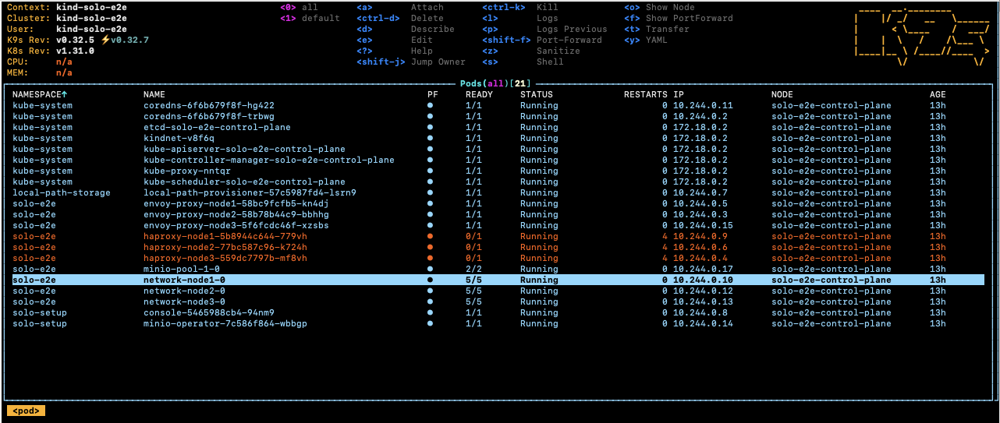
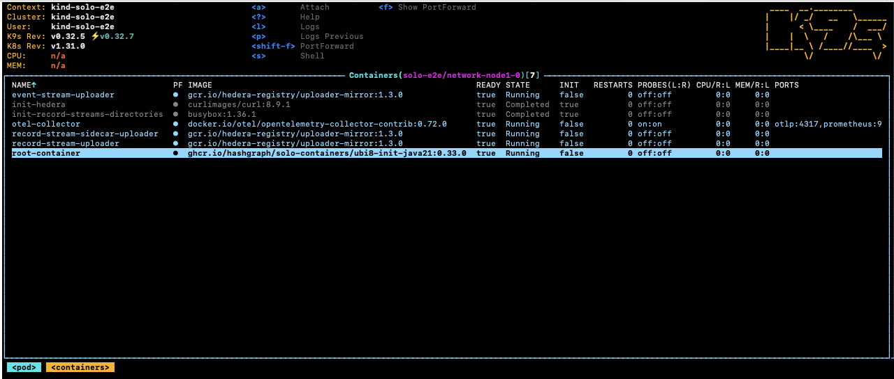
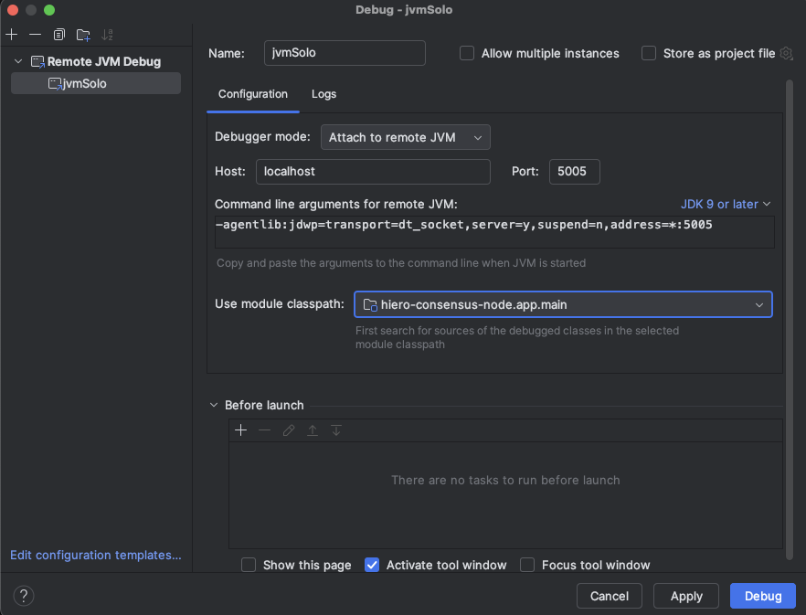
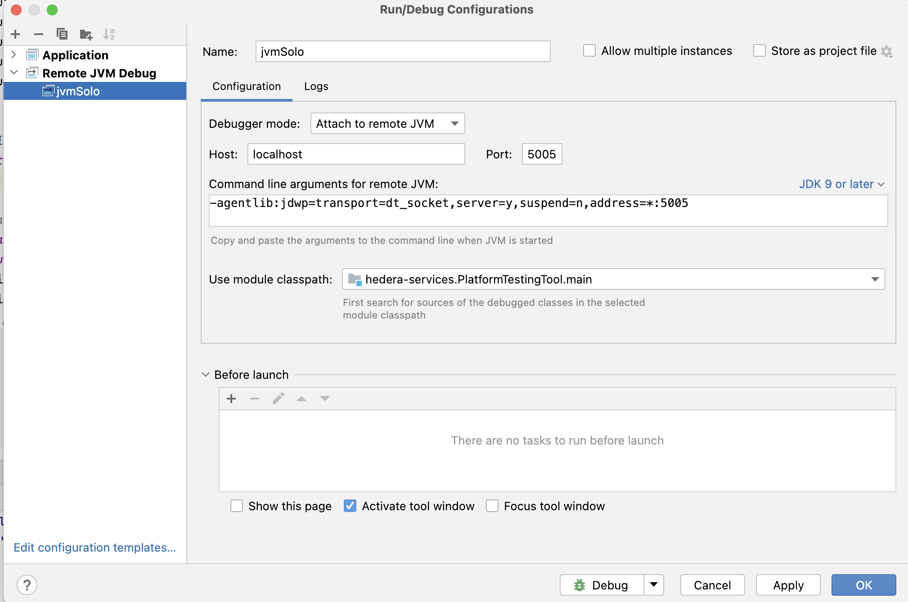
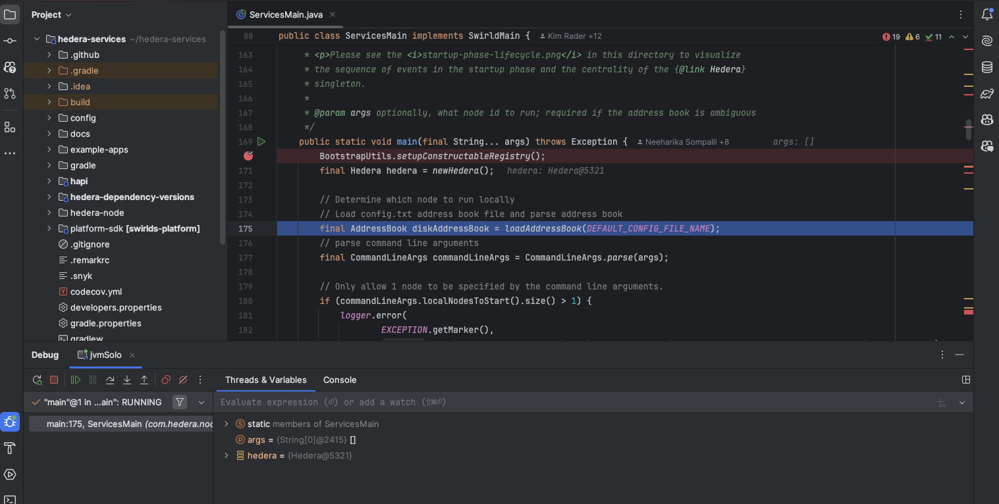
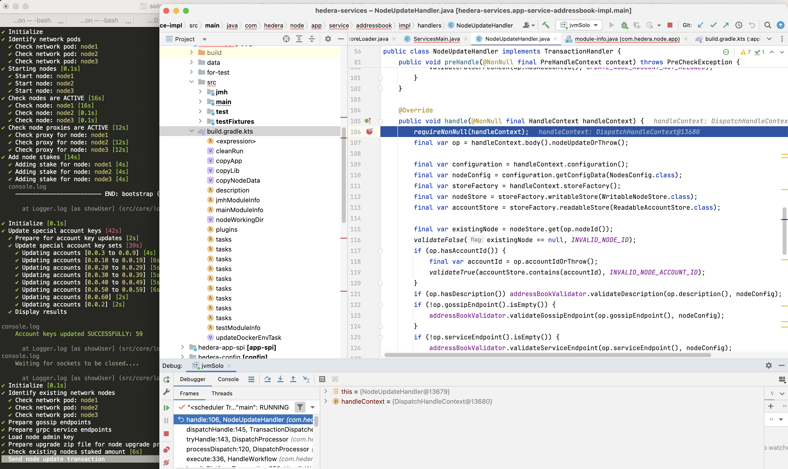

## Overview

This guide covers three debugging workflows:

- **Retrieve logs** from a running consensus node using k9s or the Solo CLI
- **Attach a JVM debugger** in IntelliJ IDEA to a running or restarting node
- **Save and restore network state files** to replay scenarios across sessions

---

## Prerequisites

Before proceeding, ensure you have completed the following:

- [**System Readiness**](/onboarding/system-readiness) — your local environment
  meets all hardware and software requirements.
- [**Quickstart**](/onboarding/quickstart) — you have a running Solo cluster and
  are familiar with the basic Solo workflow.

You will also need:

- [k9s](https://k9scli.io/) installed (`brew install k9s`)
- [IntelliJ IDEA](https://www.jetbrains.com/idea/) with a Remote JVM Debug
  run configuration (for JVM debugging only)
- A local checkout of
  [hiero-consensus-node](https://github.com/hiero-ledger/hiero-consensus-node)
  that has been built with `assemble` or `build` (for JVM debugging only)

---

## 1. Retrieve Consensus Node Logs

### Using k9s

Run `k9s -A` in your terminal to open the cluster dashboard, then select one
of the network node pods.



Select the `root-container` and press `s` to open a shell inside the container.



Navigate to the Hedera application directory to browse logs and configuration:

```bash
cd /opt/hgcapp/services-hedera/HapiApp2.0/
```

From there you can inspect logs and configuration files:

```bash
[root@network-node1-0 HapiApp2.0]# ls -ltr data/config/
total 0
lrwxrwxrwx 1 root root 27 Dec  4 02:05 bootstrap.properties -> ..data/bootstrap.properties
lrwxrwxrwx 1 root root 29 Dec  4 02:05 application.properties -> ..data/application.properties
lrwxrwxrwx 1 root root 32 Dec  4 02:05 api-permission.properties -> ..data/api-permission.properties

[root@network-node1-0 HapiApp2.0]# ls -ltr output/
total 1148
-rw-r--r-- 1 hedera hedera       0 Dec  4 02:06 hgcaa.log
-rw-r--r-- 1 hedera hedera       0 Dec  4 02:06 queries.log
drwxr-xr-x 2 hedera hedera    4096 Dec  4 02:06 transaction-state
drwxr-xr-x 2 hedera hedera    4096 Dec  4 02:06 state
-rw-r--r-- 1 hedera hedera     190 Dec  4 02:06 swirlds-vmap.log
drwxr-xr-x 2 hedera hedera    4096 Dec  4 16:01 swirlds-hashstream
-rw-r--r-- 1 hedera hedera 1151446 Dec  4 16:07 swirlds.log
```

### Using the Solo CLI (Alternative option)

To download `hgcaa.log` and `swirlds.log` as a zip archive without entering
the container shell, run:

```bash
# Downloads logs to ~/.solo/logs/<namespace>/<timestamp>/
solo consensus diagnostics all --deployment solo-deployment
```

---

## 2. Attach a JVM Debugger in IntelliJ IDEA

Solo supports pausing node startup at a JDWP debug port so you can attach
IntelliJ IDEA before the node begins processing transactions.

### Configure IntelliJ IDEA

Create a **Remote JVM Debug** run configuration in IntelliJ IDEA.

For the **Hedera Node** application:



If you are working on the **Platform** test application instead:



Set any breakpoints you need before launching the Solo command in the next step.

> **Note:** The `local-build-path` in the commands below references
> `../hiero-consensus-node/hedera-node/data`. Adjust this path to match your
> local checkout location. Ensure the directory is up to date by running
> `./gradlew assemble` in the `hiero-consensus-node` repo before proceeding.

### Example 1 — Debug a node during initial network deployment

This example deploys a three-node network and pauses `node2` for debugger
attachment.

```bash
SOLO_CLUSTER_NAME=solo-cluster
SOLO_NAMESPACE=solo-e2e
SOLO_CLUSTER_SETUP_NAMESPACE=solo-setup
SOLO_DEPLOYMENT=solo-deployment

# Remove any previous state to avoid name collision issues
rm -Rf ~/.solo
kind delete cluster -n "${SOLO_CLUSTER_NAME}"
kind create cluster -n "${SOLO_CLUSTER_NAME}"

solo init
solo cluster-ref config setup -s "${SOLO_CLUSTER_SETUP_NAMESPACE}"
solo cluster-ref config connect --cluster-ref ${SOLO_CLUSTER_NAME} --context kind-${SOLO_CLUSTER_NAME}

solo deployment config create --namespace "${SOLO_NAMESPACE}" --deployment "${SOLO_DEPLOYMENT}"
solo deployment cluster attach --deployment "${SOLO_DEPLOYMENT}" --cluster-ref ${SOLO_CLUSTER_NAME} --num-consensus-nodes 3
solo keys consensus generate --deployment "${SOLO_DEPLOYMENT}" --gossip-keys --tls-keys -i node1,node2,node3

solo consensus network deploy --deployment "${SOLO_DEPLOYMENT}" -i node1,node2,node3 --debug-node-alias node2
solo consensus node setup --deployment "${SOLO_DEPLOYMENT}" -i node1,node2,node3 --local-build-path ../hiero-consensus-node/hedera-node/data
solo consensus node start --deployment "${SOLO_DEPLOYMENT}" -i node1,node2,node3 --debug-node-alias node2
```

When Solo reaches the active-check phase for `node2`, it pauses and displays:

```bash
❯ Check all nodes are ACTIVE
  Check node: node1,
  Check node: node2,  Please attach JVM debugger now.
  Check node: node3,
? JVM debugger setup for node2. Continue when debugging is complete? (y/N)
```


At this point, launch the remote debug configuration in IntelliJ IDEA. The
node will stop at your breakpoint:





When you are done debugging, resume execution in IntelliJ, then type `y` in
the terminal to allow Solo to continue.

### Example 2 — Debug a node during a node add operation

This example starts a three-node network and then attaches a debugger while
adding `node4`.

```bash
SOLO_CLUSTER_NAME=solo-cluster
SOLO_NAMESPACE=solo-e2e
SOLO_CLUSTER_SETUP_NAMESPACE=solo-setup
SOLO_DEPLOYMENT=solo-deployment

rm -Rf ~/.solo
kind delete cluster -n "${SOLO_CLUSTER_NAME}"
kind create cluster -n "${SOLO_CLUSTER_NAME}"

solo init
solo cluster-ref config setup -s "${SOLO_CLUSTER_SETUP_NAMESPACE}"
solo cluster-ref config connect --cluster-ref ${SOLO_CLUSTER_NAME} --context kind-${SOLO_CLUSTER_NAME}

solo deployment config create --namespace "${SOLO_NAMESPACE}" --deployment "${SOLO_DEPLOYMENT}"
solo deployment cluster attach --deployment "${SOLO_DEPLOYMENT}" --cluster-ref ${SOLO_CLUSTER_NAME} --num-consensus-nodes 3
solo keys consensus generate --deployment "${SOLO_DEPLOYMENT}" --gossip-keys --tls-keys -i node1,node2,node3

solo consensus network deploy --deployment "${SOLO_DEPLOYMENT}" -i node1,node2,node3 --pvcs true
solo consensus node setup --deployment "${SOLO_DEPLOYMENT}" -i node1,node2,node3 --local-build-path ../hiero-consensus-node/hedera-node/data
solo consensus node start --deployment "${SOLO_DEPLOYMENT}" -i node1,node2,node3

solo consensus node add --deployment "${SOLO_DEPLOYMENT}" --gossip-keys --tls-keys \
  --debug-node-alias node4 \
  --local-build-path ../hiero-consensus-node/hedera-node/data \
  --pvcs true
```

### Example 3 — Debug a node during a node update operation

This example attaches a debugger to `node2` while it restarts as part of an
update operation.

```bash
SOLO_CLUSTER_NAME=solo-cluster
SOLO_NAMESPACE=solo-e2e
SOLO_CLUSTER_SETUP_NAMESPACE=solo-setup
SOLO_DEPLOYMENT=solo-deployment

rm -Rf ~/.solo
kind delete cluster -n "${SOLO_CLUSTER_NAME}"
kind create cluster -n "${SOLO_CLUSTER_NAME}"

solo init
solo cluster-ref config setup -s "${SOLO_CLUSTER_SETUP_NAMESPACE}"
solo cluster-ref config connect --cluster-ref ${SOLO_CLUSTER_NAME} --context kind-${SOLO_CLUSTER_NAME}

solo deployment config create --namespace "${SOLO_NAMESPACE}" --deployment "${SOLO_DEPLOYMENT}"
solo deployment cluster attach --deployment "${SOLO_DEPLOYMENT}" --cluster-ref ${SOLO_CLUSTER_NAME} --num-consensus-nodes 3
solo keys consensus generate --deployment "${SOLO_DEPLOYMENT}" --gossip-keys --tls-keys -i node1,node2,node3

solo consensus network deploy --deployment "${SOLO_DEPLOYMENT}" -i node1,node2,node3
solo consensus node setup --deployment "${SOLO_DEPLOYMENT}" -i node1,node2,node3 --local-build-path ../hiero-consensus-node/hedera-node/data
solo consensus node start --deployment "${SOLO_DEPLOYMENT}" -i node1,node2,node3

solo consensus node update --deployment "${SOLO_DEPLOYMENT}" \
  --node-alias node2 \
  --debug-node-alias node2 \
  --local-build-path ../hiero-consensus-node/hedera-node/data \
  --new-account-number 0.0.7 \
  --gossip-public-key ./s-public-node2.pem \
  --gossip-private-key ./s-private-node2.pem \
  --release-tag v0.59.5
```

### Example 4 — Debug a node during a node delete operation

This example attaches a debugger to `node3` while `node2` is being removed
from the network.

```bash
SOLO_CLUSTER_NAME=solo-cluster
SOLO_NAMESPACE=solo-e2e
SOLO_CLUSTER_SETUP_NAMESPACE=solo-setup
SOLO_DEPLOYMENT=solo-deployment

rm -Rf ~/.solo
kind delete cluster -n "${SOLO_CLUSTER_NAME}"
kind create cluster -n "${SOLO_CLUSTER_NAME}"

solo init
solo cluster-ref config setup -s "${SOLO_CLUSTER_SETUP_NAMESPACE}"
solo cluster-ref config connect --cluster-ref ${SOLO_CLUSTER_NAME} --context kind-${SOLO_CLUSTER_NAME}

solo deployment config create --namespace "${SOLO_NAMESPACE}" --deployment "${SOLO_DEPLOYMENT}"
solo deployment cluster attach --deployment "${SOLO_DEPLOYMENT}" --cluster-ref ${SOLO_CLUSTER_NAME} --num-consensus-nodes 3
solo keys consensus generate --deployment "${SOLO_DEPLOYMENT}" --gossip-keys --tls-keys -i node1,node2,node3

solo consensus network deploy --deployment "${SOLO_DEPLOYMENT}" -i node1,node2,node3
solo consensus node setup --deployment "${SOLO_DEPLOYMENT}" -i node1,node2,node3 --local-build-path ../hiero-consensus-node/hedera-node/data
solo consensus node start --deployment "${SOLO_DEPLOYMENT}" -i node1,node2,node3

solo consensus node destroy --deployment "${SOLO_DEPLOYMENT}" \
  --node-alias node2 \
  --debug-node-alias node3 \
  --local-build-path ../hiero-consensus-node/hedera-node/data
```

---

## 3. Save and Restore Network State

You can snapshot the state of a running network and restore it later. This is
useful for replaying specific scenarios or sharing reproducible test cases with
the team.

### Save state

Stop the nodes first, then download the state archives:

```bash
# Stop all nodes before downloading state
solo consensus node stop --deployment "${SOLO_DEPLOYMENT}"

# Download state files to ~/.solo/logs/<namespace>/
solo consensus state download -i node1,node2,node3 --deployment "${SOLO_DEPLOYMENT}"
```

The state files are saved under `~/.solo/logs/`:

```bash
└── logs
    ├── solo-e2e
    │   ├── network-node1-0-state.zip
    │   └── network-node2-0-state.zip
    └── solo.log
```

### Restore state

Create a fresh cluster, deploy the network, then upload the saved state before
starting the nodes:

```bash
SOLO_CLUSTER_NAME=solo-cluster
SOLO_NAMESPACE=solo-e2e
SOLO_CLUSTER_SETUP_NAMESPACE=solo-setup
SOLO_DEPLOYMENT=solo-deployment

rm -Rf ~/.solo
kind delete cluster -n "${SOLO_CLUSTER_NAME}"
kind create cluster -n "${SOLO_CLUSTER_NAME}"

solo init
solo cluster-ref config setup -s "${SOLO_CLUSTER_SETUP_NAMESPACE}"
solo cluster-ref config connect --cluster-ref ${SOLO_CLUSTER_NAME} --context kind-${SOLO_CLUSTER_NAME}

solo deployment config create --namespace "${SOLO_NAMESPACE}" --deployment "${SOLO_DEPLOYMENT}"
solo deployment cluster attach --deployment "${SOLO_DEPLOYMENT}" --cluster-ref ${SOLO_CLUSTER_NAME} --num-consensus-nodes 3
solo keys consensus generate --deployment "${SOLO_DEPLOYMENT}" --gossip-keys --tls-keys -i node1,node2,node3

solo consensus network deploy --deployment "${SOLO_DEPLOYMENT}" -i node1,node2,node3
solo consensus node setup --deployment "${SOLO_DEPLOYMENT}" -i node1,node2,node3 --local-build-path ../hiero-consensus-node/hedera-node/data
solo consensus node start --deployment "${SOLO_DEPLOYMENT}" -i node1,node2,node3
solo consensus node stop --deployment "${SOLO_DEPLOYMENT}"

# Upload previously saved state files
solo consensus node states -i node1,node2,node3 --deployment "${SOLO_DEPLOYMENT}"

# Restart the network using the uploaded state
solo consensus node start --deployment "${SOLO_DEPLOYMENT}" --state-file network-node1-0-state.zip
```
---